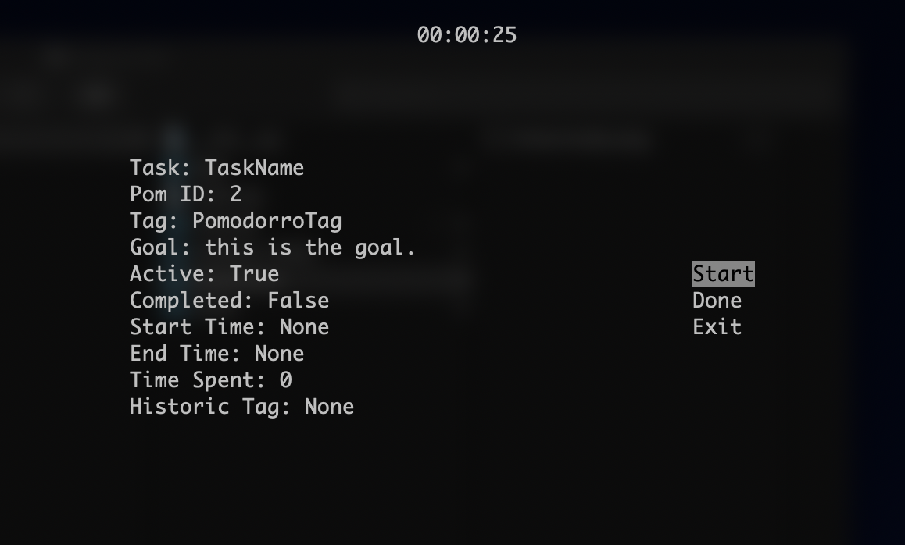

# PomodorrosCLI User Manual

**Topics:**

* [Overview](#overview)
    + [Prerequisites](#prerequisites)
    + [Installation and Setup](#installation-and-setup)
        + [installing](#installing)
        + [setup](#setup)
* [Commands](#commands)
    + [**Settings**](#settings)
        + [set](#settings-set)
        + [show](#settings-show)
    + [**TaskLog**](#tasklog)
        + [show](#tasklog-show)
        + [add](#tasklog-add)
        + [delete](#tasklog-delete)
    + [**PomLog**](#pomlog)
        + [show](#pomlog-show)
    + [**Task**](#task)
        + [show](#task-show)
        + [add](#task-add)
        + [delete](#task-delete)
        + [edit](#task-edit)
    + [**Pomodorro**](#pomodorro)
        + [show](#pomodorro-show)
        + [tag](#pomodorro-tag)
        + [goal](#pomodorro-goal)
        + [edit](#pomodorro-edit)
    + [**Timer**](#timer)
        + [set](#timer-set)
* [Coming Soon...](#coming-soon...)

## Overview

> `Note`: The contents of this manual apply to version `0.1.0` and all subsequent releases unless otherwise noted.

PomodorrosCLI, or pomcli for short, is a command line application that allows users to better manage their time. This application is based largely on the pomodorro technique. You can learn more about this technique from the wikipedia article: [pomodorro technique](https://en.wikipedia.org/wiki/Pomodoro_Technique).

The concept is straightforward: The user breaks up `tasks` into smaller units of time called `pomodorros`, which are typically 25 minutes long. After completing work for that unit of time, a brief rest period follows which is typically 5 minutes long. This process repeats until the user accomplishes everything that they need to do. 

### Prerequisites

[Python 3.7](www.python.org/downloads) or newer.

### Installation and Setup

> `Note`: As of version `0.1.0`, PomodorrosCLI has only been tested on macOS Catalina. There are no guarantees that this software will behave as intended, or work at all, on other operating systems.

#### Installing

Clone this repo to your environment. Hit the download button or from the terminal type:
```
git clone https://github.com/TadayoshiCarvajal/PomodorrosCLI
```

> `Note`: Keep track of where you installed the project. You will need it to alias the command. 

#### Setup

Once you've downloaded or cloned a copy of PomodorrosCLI, use a text editor or IDE to add the pomcli alias to your environment. On MacOS:
```
cd ~
open -a "Visual Studio Code" .bash_profile
```

Add the following line to your .bash_profile file to create the alias to your pomcli/main.py file:
```
alias pomcli="python3 ~/Desktop/PomodorrosCLI/pomcli/main.py"
```
> `Note`: replace `~/Desktop/PomodorrosCLI/pomcli/main.py` with the location of your main.py file*

> `Note`: aliasing is not required to use `PomodorrosCLI`, but it will allow you to use the program from any directory, and avoids typing out `python main.py` before every command. Starting now, this instruction manual will assume you've created the alias.

Once you've created the alias, save and close the .bash_profile file. Initialize the application with the following terminal command:
```
$ pomcli
```

If you see the message,
```
Successfully intialized PomodorrosCLI!
```
then congratulations, you are all set!

## Commands

To invoke a command using PomodorrosCLI, we use the following syntax:
```
$ pomcli <command_object> <action> <options>
```
> `Note`: the `$` symbol above exists to show that the text that follows it is typed directly into the terminal. It should not be included in the `pomcli` command.

`<options>` denotes the optional values that can be passed into the command. These are kind of like flags in Linux and Unix shell commands, and they typically alter the normal behavior of the command, or provides additionally functionality, but in some cases, are required.

Sometimes, a `command object` requires an `object id`. This is the case for the `Task` and `Pomodorro` objects. In such situations, we use the following syntax:
```
$ pomcli <command_object> <object_id> <action> <options>
```

The remainder of this manual will focus on the specifics of which actions and options can be supplied to which commands, and provides examples. We begin with the `Settings` object.

### Settings

`Settings` is the object responsible for managing the application settings.

**Settings List:**

`pomodorro_length` : int - the number of minutes long for the work phase of a pomodorro

`rest_length` : int - the number of minutes long for the rest phase of a pomodorro

`column_width` : int - the amount of space each column occupies in the PomodorroLog and TaskLog show commands output.

`hide_success` : bool - a boolean that will hide the "Success" message that gets printed after each successful pomcli command.

#### Settings Set

This command allows the user to change the values of the `settings`.

```
$ pomcli settings set rest_length=10
```

The above command changes the `rest_length` setting to 10 minutes.
Multiple settings can be modified within the same command:
```
$ pomcli settings set rest_length=10 pomodorro_length=20
```

#### Settings Show

This command allows the user to display the values of the `settings`.

```
$ pomcli settings show
```

This command takes as `options` specific settings:

```
$ pomcli settings show pomodorro_length
```
The above command will display only the `pomodorro_length` setting. Multiple settings can be specified in the same command just like in the [`settings set`](#settings-set) command.

```
$ pomcli settings show pomodorro_length rest_length
```

### TaskLog

The `TaskLog` object, aka `tasklog`, acts as a collection object that stores the `Tasks` created by the user. Read more about the `Task` object by clicking this [link](#task).

#### TaskLog Show

This command allows the user to display the `Tasks` that they've created:
```
$ pomcli tasklog show
```
> `Note`: If the user has no `Tasks`, this command will still print the header row of the `tasklog`.

#### TaskLog Add

This command allows the user to create a `Task` by adding it to the `tasklog`:
```
$ pomcli tasklog add name=TaskName
```
This creates a `Task` with the name *TaskName*. The following attributes can be specified using the attribute=value format:
```
    name - a string representing the name of the task.
    repeats = {'once', 'daily', 'weekly', 'monthly', 'yearly'}
    priority = an integer from 1 - 10 (1 is least importance; 10 is most importance)
    pomodorro_length = an integer representing number of minutes pomodorros of this task last by default.
    rest_length = an integer representing number of minutes rests of this task last by default.
```
As of version `0.2.0`, repeats will enable the following behaviors:

`once` - pomodorros belonging to this task will not repeat, but a due date can be specified and pomodorro_complete can be set to True.

`daily` - pomodorros belonging to this task will expired at midnight of each day if the pomodorro is not completed.

`weekly` - pomodorros belonging to this task will expired at midnight on Sunday of each week if the pomodorro is not completed.

`monthly` - pomodorros belonging to this task will expired at midnight on the last day of each month if the pomodorro is not completed.

`yearly` - pomodorros belonging to this task will expired at midnight December 31st of each year if the pomodorro is not completed.

> `Note`: you may expect customization for when repeating pomodorros expire and refresh in `0.3.0`.

#### TaskLog Delete

This command allows the user to delete a `Task` by removing it from the `tasklog`:
```
$ pomcli tasklog delete TaskName
```
This deletes a `Task` with the name *TaskName* if such a task exists.
> `Note`: when you delete a `Task`, you also delete all of the `Pomodorros` belonging to that task. Once performed, this action cannot be undone. 

### PomLog

The `PomLog` object, aka `pomlog`, acts as a collection object that stores the `Pomodorros` created by the user. Read more about the `Pomodorro` object by clicking this [link](#pomodorro).

#### PomLog Show

This command allows the user to display the `Pomodorros` that they've created:
```
$ pomcli pomlog show
```
> `Note`: If the user has no `Pomodorros`, this command will still print the header row of the `pomlog`.

### Task

The `Task` object represents a real-world task that the user wishes to accomplish. Every task that is created is placed in the `tasklog`. That is, a `Task` cannot exist outside of the `tasklog`. Read more about the `tasklog` object by clicking this [link](#tasklog).

`Tasks` have the following two attributes:

`name` : str - the distinct name of the `Task`.

`repeats` : {"once", "daily", "weekly", "monthly", "yearly"} - how frequently this task repeats.

> `Note`: the following examples assume that the user has a `Task` with the `name` *TaskName*. Alternatively, the `Task ID` can be used in place of the `name`.

#### Task Show

This command allows the user to display the information pertaining to this `Task`:
```
$ pomcli task TaskName show
```

#### Task Add

This command allows the user to add a `Pomodorro` to this `Task`:
```
$ pomcli task TaskName add tag=PomodorroTag goal="This is the goal."
```

The above command created a `Pomodorro` with the `pomodorro tag` *PomodorroTag* for the `Task` *TaskName*. It also gave that `Pomodorro` a `goal`, specified by the string *"This is the goal."*.

The following attributes can be specified using the attributes=value format:
```
    tag = a string representing a nickname for the pomodorro
    goal = a string detailing the goal of this pomodorro
    length = the number of minutes this pomodorro is to last.
    rest = the number of minutes the rest for this pomodorro is to last.
    once_due = If the pomodorro belongs to a "once" repeating task, this specifies the date and time the pomodorro is due.
```

`Pomodorro tags`, aka `tags`, are **not required**. A pomodorro can always be referred to by its `Pomodorro ID`. `Tags` provide a convenient way of referring to a `Pomodorro` without needing to memorize its `pomodorro ID`.

`Pomodorro Goals`, aka `Goals`, are also not required. This means we also could have created a `Pomodorro` using the following command:
```
$ pomcli task TaskName add
```
This adds a tagless and goalless pomodorro to the `Task` *TaskName* 

#### Task Delete

This command allows the user to delete a `Pomodorro` by removing it from the `Task` and the `pomlog`:
```
$ pomcli task TaskName delete PomodorroTag
```
> `Note`: this example assumes that the `Task` *TaskName* has a `Pomodorro` with the `tag` *PomodorroTag*.

#### Task Edit

This command allows the user to edit the information belonging to a `Task`.
```
$ pomcli task TaskName edit <attribute>=<value>
```
> `Note`: as of version `0.2.0` all attributes that can be specified with TaskLog Add can be edited.

##### pomodorro_complete

In addition to the attributes that can be determined at Task creation, *pomodorro_complete* is a boolean attribute that can be specified after a task is created, its repeats value is set to 'once', and at least one unexpired and incomplete pomodorro belongs to the task. If *pomodorro_complete*=True, the task will be marked complete once its last pomodorro has been completed.

### Pomodorro

The `Pomodorro` object represents a block of time dedicated to performing a `Task`. Every `Pomodorro` belongs to a `Task` and exists in the `pomlog`.

`Pomodorros` have the following attributes:

`tag` : str - the distinct and optional alias for this `Pomodorro`.

`goal` : str - a string that describes what the user wants to accomplish with this `Pomodorro`.

> `Note`: the following examples assume that the user has a `Pomodorro` with the `tag` *PomodorroTag*. Alternatively, the `Pomodorro ID` can be used in place of the `tag`.

> `Note`: `pom` serves as an alias to the `Pomodorro` object. The following examples utilize this alias.

#### Pomodorro Show

This command allows the user to display the information belonging to a `Pomodorro`.
```
$ pomcli pom PomodorroTag show
```

#### Pomodorro Tag

This command allows the user to set the `tag` belonging to a `Pomodorro`.
```
$ pomcli pom PomodorroTag tag NewTag
```

The `Pomodorro`'s `tag` has now changed from *PomodorroTag* to *NewTag*

#### Pomodorro Goal

This command allows the user to set the `goal` belonging to a `Pomodorro`.
```
$ pomcli pom PomodorroTag goal "this is the new goal."
```
The `Pomodorro`'s `goal` has now been set to the string *"this is the new goal."*

#### Pomodorro Edit

This command allows the user to set the attributes belonging to a `Pomodorro`.
```
$ pomcli pom PomodorroTag edit tag='new tag'
```
> `Note`: as of version `0.2.0` all attributes that can be specified with Task Add can be edited with Pomodorro Edit.

### Timer

The `Timer` object allows us to track the amount of time we've worked on a `Pomodorro`. It provides an interactive terminal environment known as `timer mode` that we interact with by using the **UP, DOWN, LEFT, RIGHT,** and **ENTER** keys on the keyboard.

#### Timer Set

This command allows the user to set a `Pomodorro` to active and enters `timer mode`.
```
$ pomcli timer set PomodorroTag
```

This command initiates `timer mode` which looks like:



In `timer mode`, we use the **UP, DOWN, LEFT, RIGHT,** and **ENTER** keys on the keyboard to navigate and select what we want the `Timer` to do. 

**Start** - begins the `timer`.

**Pause** - pauses the `timer` when it is running.

**Resume** - resumes the `timer` when it is paused.

**Done** - completes the `Pomodorro` earlier than specified by `pomodorro_length`.

**Exit** - exits `timer mode` and deletes any progress made towards completing the `Pomodorro`.

## Coming Soon...

There is a lot more coming to `PomodorrosCLI` that is anticipated by version `1.0.0`. Some of these features include:

* `More options` - Many more options for the existing commands, including the ability to display how much time has been spent on a particular task, will be added. 

* `Migrator Tool` - A tool that will allow users to migrate their pomodorros.db data from version to version.

* `Recurrent Tasks and Pomodorros` - `tasks` can be specified as being `recurrent`, which means they will autopopulate `pomodorros` into the `pomlog` according to their `repeats` frequency.

* `Help object` - An additional command object which will take other command objects and actions as parameters, and display helpful information about them right from the terminal.

* `Task and Pomodorro Priority` - A priority value can be assigned to Tasks and Pomodorros. This will be used in determining the order of how Tasks and Pomodorros are displayed, among other things.

* `Recommender System` - a machine learning system that uses historical usage data to predict what task/pomodorro should be worked on at any given time.